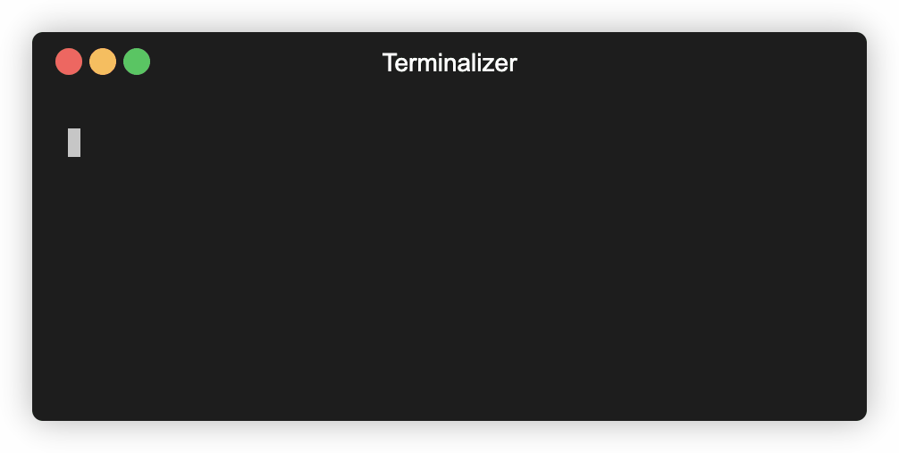
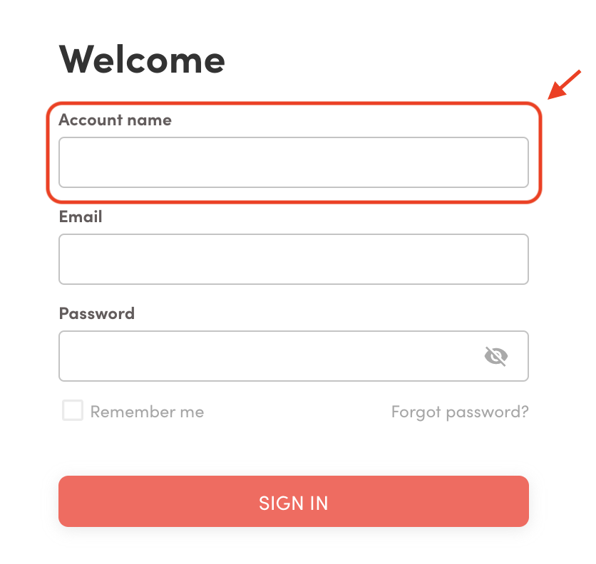
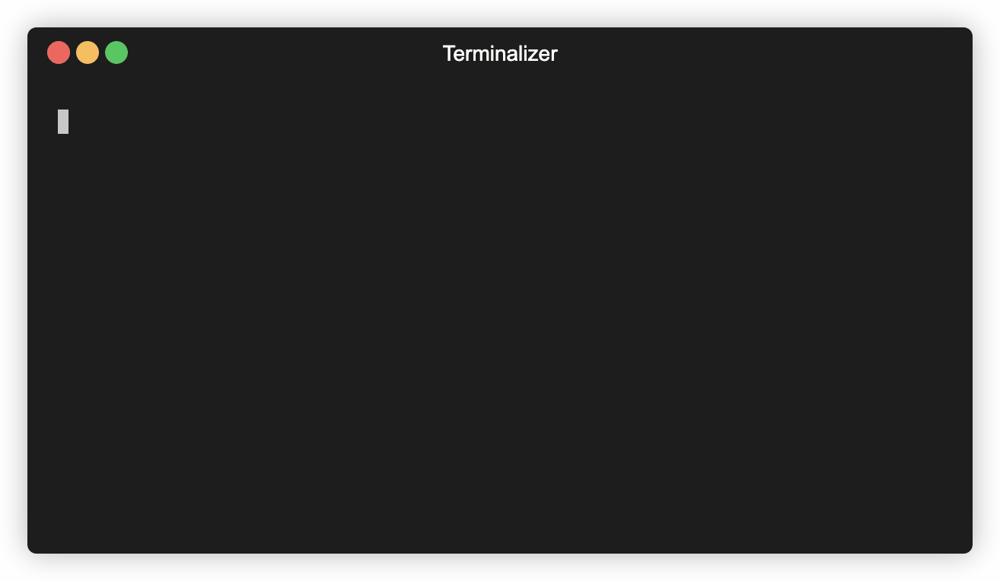
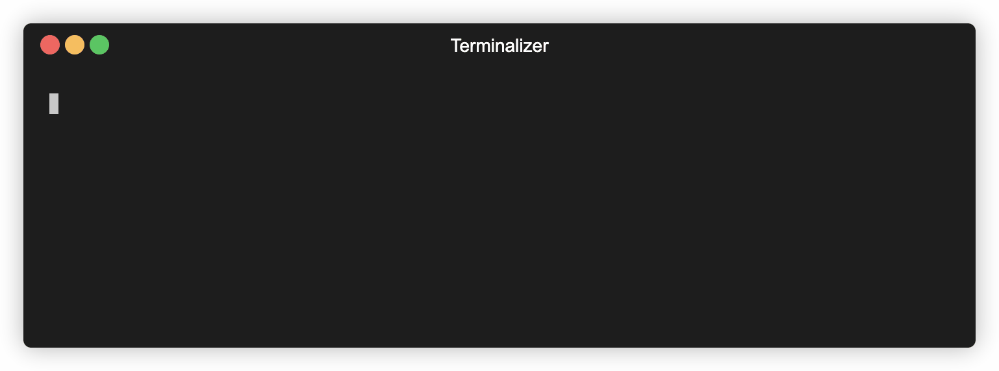
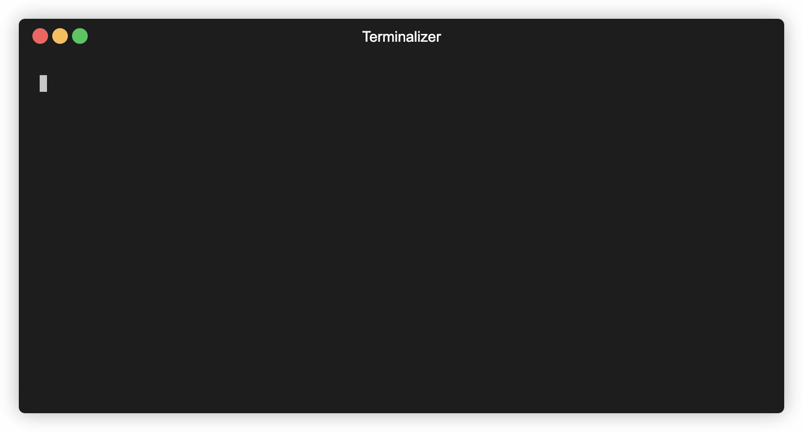

<!-- <p align="center">
  <a href="http://suite-api.superb-ai.com/" target="blank"></a>
</p> -->

# Superb AI Suite Command Line Tool


[](https://opensource.org/licenses/MIT)
<!---->


Official Superb AI Suite Command Line Interface for managing data and labels on [Superb AI Suite](https://suite.superb-ai.com).

- [Installation](#Installation)
- [Authentication](#Authentication)
- [Resource Description](#Resource-Description)
    - [Projects](#Projects)
- [Uploading Dataset](#Uploading-Dataset)
- [Downloading Data & Labels](#Downloading-Data--Labels)
- [Contributing](#Contributing)
- [License](#License)

## Installation

```shell
$ pip install spb-cli
$ spb --version

0.0.xx
``` 
Once installed, you can type `spb` command in the terminal to access the command line interface.

<!---

-->

## Authentication



You need an *Access Key* for authentication. The *Access Key* can be generated on the :tada: [Superb AI Suite web](https://suite.superb-ai.com/) (Suite > My Account > Advanced).

You can then configure your profile by entering your *Suite Team Name* and the generated *Access Key*. 

:rotating_light: ***Suite Team Name* refers to the organization name that your personal account belongs to:**



```shell
$ spb configure
Suite Team Name: foo
Access Key: bar
```

Once configured, you can check the currently configured profile by using the `--list` option.


```
$ spb configure --list

[default]
access_key = foo
team_name = bar
```

## Resource Description

### Projects



You can list all projects that belong to the currently configured profile by using the following command:
```shell
$ spb describe projects

┏━━━━━━━━━━━━━┳━━━━━━━━┳━━━━━━━━━━━━━━━┳━━━━━━━━━━━━━┳━━━━━━━━━┓
┃ NAME        ┃ LABELS ┃   IN PROGRESS ┃   SUBMITTED ┃ SKIPPED ┃
┡━━━━━━━━━━━━━╇━━━━━━━━╇━━━━━━━━━━━━━━━╇━━━━━━━━━━━━━╇━━━━━━━━━┩
│ my-project  │   6000 │   1000 (16 %) │ 2000 (33 %) │ 0 (0 %) │
...
Press any button to continue to the next page (1/10). Otherwise press ‘Q’ to quit.
```

## Uploading Dataset



You can upload data and create labels for your project with this command line interface. 

Move to the dataset directory that has image files (with extension of `.jpg`, `.png`, `.gif`) and upload images in the directory by using the following CLI command:

```shell
$ cd some-folder
$ spb upload dataset
Project Name: my-project
Dataset Name: my-dataset

Uploading 3 data and 0 labels to dataset 'my-dataset' under project 'my-project'. Proceed? [y/N]: y
Uploading data:
100%|██████████████████████████████████████████████████| 3/3 [00:03<00:00,  1.06s/it]
```

If you wish to upload the **label** files along with the dataset, you can enable the `--include-label` option:

```shell
$ cd some-folder
$ spb upload dataset --include-label
Project Name: my-project
Dataset Name: my-dataset

Uploading 3 data and 0 labels to dataset 'my-dataset' under project 'my-project'. Proceed? [y/N]: y
Uploading data:
100%|██████████████████████████████████████████████████| 3/3 [00:03<00:00,  1.06s/it]
Uploading labels:
100%|██████████████████████████████████████████████████| 3/3 [00:03<00:00,  3.40s/it]
```

To learn how to create a **label** JSON file according to the Superb AI format, please refer to the **Annotation JSON File Structure** section in the linked [Superb AI Suite Manual](https://www.notion.so/Export-Result-Format-6d45fca9c85841aea7014372fb3dd2c8#bf31abcd73da4ad899ea05a4b052d262).

<!---
Or if you wish to only upload the **pre-label** :label: files:

```shell
$ spb upload labels
Project Name: my-project
Dataset Name: my-dataset
```

To understand how to construct a **label** JSON file according to the Superb AI format, please refer to the "Annotation JSON File Structure" section in the linked [Superb AI Suite Manual](https://www.notion.so/Export-Result-Format-6d45fca9c85841aea7014372fb3dd2c8#bf31abcd73da4ad899ea05a4b052d262).
-->

## Downloading Data & Labels



You can download images and labels for a project by using the following command:
```shell
$ cd some-folder
$ spb download
Project Name: my-project

Downloading 3 data and 3 labels from project 'my-project' to '.'. Proceed? [y/N]: y
100%|██████████████████████████████████████████████████| 1/1 [00:00<00:00,  1.11it/s]

** Result Summary **
Successful download of 3 out of 3 labels. (100.0%)
Successful download of 3 out of 3 data. (100.0%)
```

The result is saved to the designated directory. For example:

```
└─ some-folder
   └─ my-dataset
      ├─ 1.jpg
      ├─ 1.jpg.json
      ├─ 2.jpg
      ├─ 2.jpg.json
      ...
```

## Contributing

Feel free to report issues and suggest improvements.  
Please email us at support@superb-ai.com

## License

The MIT License (MIT)

Copyright (c) 2020, Superb AI, Inc.

Permission is hereby granted, free of charge, to any person obtaining a copy of this software and associated documentation files (the "Software"), to deal in the Software without restriction, including without limitation the rights to use, copy, modify, merge, publish, distribute, sublicense, and/or sell copies of the Software, and to permit persons to whom the Software is furnished to do so, subject to the following conditions:

The above copyright notice and this permission notice shall be included in all copies or substantial portions of the Software.

THE SOFTWARE IS PROVIDED "AS IS", WITHOUT WARRANTY OF ANY KIND, EXPRESS OR IMPLIED, INCLUDING BUT NOT LIMITED TO THE WARRANTIES OF MERCHANTABILITY, FITNESS FOR A PARTICULAR PURPOSE AND NONINFRINGEMENT. IN NO EVENT SHALL THE AUTHORS OR COPYRIGHT HOLDERS BE LIABLE FOR ANY CLAIM, DAMAGES OR OTHER LIABILITY, WHETHER IN AN ACTION OF CONTRACT, TORT OR OTHERWISE, ARISING FROM, OUT OF OR IN CONNECTION WITH THE SOFTWARE OR THE USE OR OTHER DEALINGS IN THE SOFTWARE.
